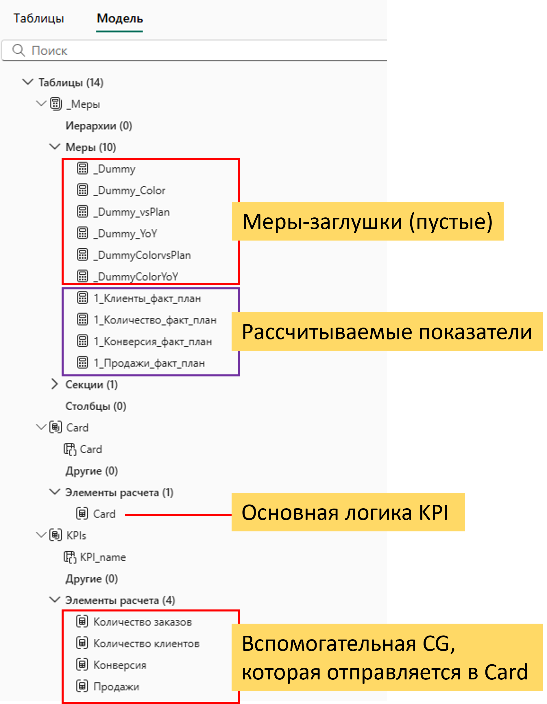
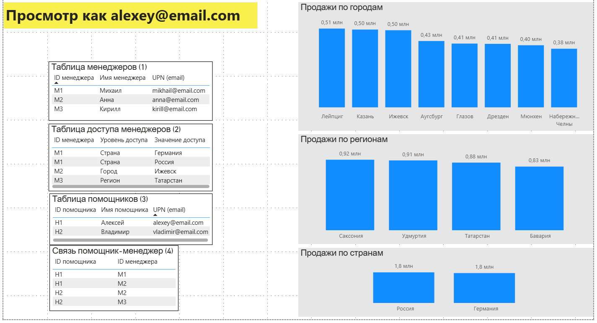
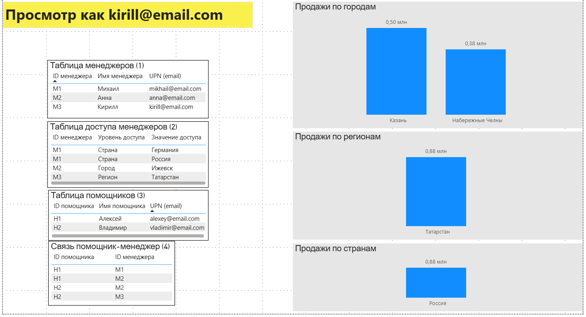
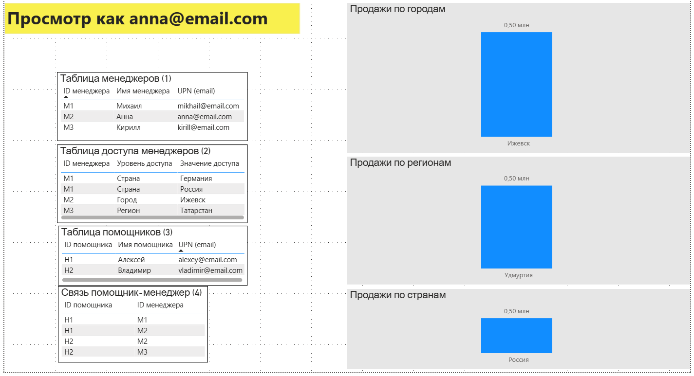
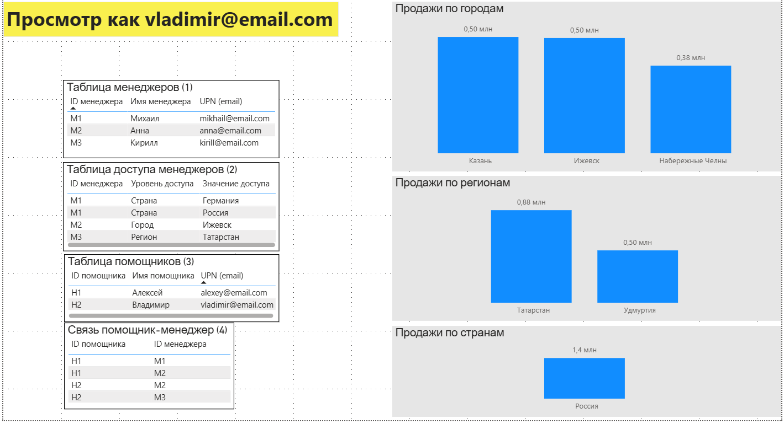
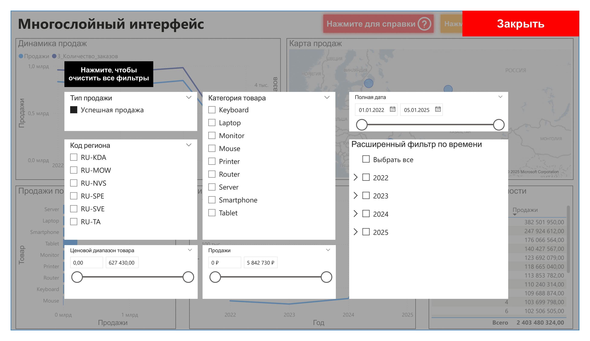

# Продвинутые техники Power BI

## Короткое описание

&nbsp;&nbsp;&nbsp;&nbsp;Проект по сбору и демонстрации продвинутых методик в Microsoft Power BI для оптимизации затрат бизнеса на разработку и поддержку отчётов.  
Каждая страница в `.pbix` файле представляет собой отдельную методику. На текущий момент в файле имеются: мульти-KPI через Calculation Group, динамический RLS, страница фильтров и подсказок (многослойный интерфейс).

> Цель данного проекта - демонстрация backend-решений и архитектурных паттернов (DAX, Calculation Groups), а не визуальный дизайн. Интерфейс служит для проверки и демонстрации работы логики. **Данные синтетические**, генерировались по мере необходимости.

**Стек**: Microsoft Power BI (DAX, M-language).

## Обзор результатов

|Бизнес проблема| Решение (методика) | Краткое описание | Преимущества |
| :--- | :--- | :--- | :--- |
|Стандартный подход к KPI-карточкам в Power BI "раздувает" модель. Если бизнесу нужно 10 показателей, каждый с 4-5 вариантами (Факт, План, YoY, % от плана), разработчику приходится создавать и поддерживать 40-50+ отдельных мер. Это делает модель сложной, дорогой в поддержке и замедляет добавление новых KPI.| Динамические KPI через Calculation Groups | Методика, позволяющая формировать одновременно несколько KPI для любого количества показателей без создания отдельных мер под каждое вычисление. Calculation Groups обеспечивают единый механизм выбора метрики и типа расчёта, что позволяет быстро масштабировать набор KPI и удерживать модель компактной. | • Существенное сокращение количества мер в модели, упрощение поддержки.<br>• Быстрое добавление новых KPI без рефакторинга модели.<br>• Централизованная логика расчётов и форматирования. |
|Стандартный RLS негибок для сложных оргструктур. Часто возникает задача, когда "помощник" должен видеть данные нескольких своих руководителей (получить "сумму" их доступов). При этом система должна быть стабильной при смене email или увольнении сотрудников и не требовать переписывания DAX-кода.| Модульная система безопасности (RLS) | Расширяемый слой безопасности, который накладывается поверх базовой RLS-логики. Позволяет добавлять дополнительные уровни доступов, не нарушая существующую структуру. При этом расширение можно включать или отключать без воздействия на базовые правила. | • Гибкое масштабирование системы доступов без изменения основного RLS-ядра.<br>• Модульность: дополнительные правила легко подключать и отключать.<br>• Стабильность базовой модели безопасности при росте организационных требований. |
|Иногда дашборд может быть перегружен элементами. Большое количество фильтров, кнопок и справочной информации занимает место на холсте и отвлекает пользователя от данных. Это ухудшает User Experience  и мешает восприятию.| Многослойный интерфейс через закладки | Использование закладок Power BI для создания интерактивных слоёв интерфейса: всплывающие справочные окна, панели с фильтрами или дополнительными действиями (например, кнопка отправки письма). Закладки позволяют формировать многоуровневую пользовательскую навигацию без изменения основной структуры отчёта и улучшить User Experience. | • Создание полноценных UI-оверлеев без кастомных визуалов.<br>• Повышение удобства пользователя за счёт контекстных подсказок и вспомогательных панелей.<br>• Гибкость в расширении интерфейса без влияния на визуалы и данные. |

## Содержание
- [Короткое описание](#короткое-описание)
- [Обзор результатов](#обзор-результатов)
- [Мульти-KPI](#мульти-kpi)
- [Динамический (модульный) RLS](#dynamic-rls)
- [Многослойный интерфейс](#многослойный-интерфейс)
- [Источники и материалы](#источники-и-материалы)

## Мульти-KPI
&nbsp;&nbsp;&nbsp;&nbsp;Реализована схема отображения KPI, позволяющая быстро формировать карточки метрик для любого набора показателей без дублирования мер. Выбор показателя (текущее значение, YoY, отклонение от плана) и форматирование вынесены в отдельные Calculation Groups. Базовые вычисления оставлены в виде единого набора исходных мер. В результате пользователь получает слайсер показателей и сетку карточек KPI, где для каждой выбранной метрики динамически рассчитываются и форматируются текущие значения, сравнительные метрики и цветовые индикации. Такой подход сокращает количество мер в модели, упрощает сопровождение и позволяет быстро добавлять новые KPI без рефакторинга логики отчёта. За основу взята статья [1].

<table align="center" border="0" cellspacing="0" style="border:none; width:98%;">

  <tr style="border:none;">
    <td align="center" style="border:none; vertical-align:top; width:48%; background-color:white; padding:5px;">
      <a href="images/sales_synthetic-1.png"></a>
      <br>(а)
    </td>
    <td align="center" style="border:none; vertical-align:top; width:20%; background-color:white; padding:5px;">
      <a href="images/KPI_structure_commented.png"></a>
      <br>(б)
    </td>
  </tr>
</table>

<div align="center">
  <p style="font-size:90%; color:gray; margin-top:10px; text-align:left; max-width:900px;">
    <b>Динамическое создание KPI:</b> (а) — карточки создаются автоматически, по мере добавления новых базовых показателей (сейчас: клиенты, заказы, конверсия, продажи); (б) — структура модели Power BI
  </p>
</div>

&nbsp;&nbsp;&nbsp;&nbsp;Суть: **(1)** сначала создаётся группа мер-пустышек (например `_Dummy`, `_Dummy_YoY`, `_Dummy_vsPlan`, `_Dummy_Color`, `_DummyColorYoY` и т.д.), которые служат маркерами/«целью» для calculation items. Эти меры не содержат логики, но они нужны, чтобы calculation items могли «опознать», какую часть карточки нужно вернуть. **(2)** Затем создаётся группа `KPIs` (calculation group) - набор calculation items, по одному на KPI (*продажи*, *клиенты*, *конверсия* и т.д.), которые при выборе KPI подставляют соответствующую базовую меру через SELECTEDMEASURE() / ISSELECTEDMEASURE(). **(3)** После этого добавляется основная группа вычислений (`Card`) с одним большим calculation-item, который берет SELECTEDMEASURE() (то, что выбрала группа `KPIs`) и вычисляет необходимые показатели: фактическое значение, плановое значение, значения на прошлый год и т.д. Здесь же можно вставить код расчёта форматирования и получить нужное значение цвета в зависимости от того, какая мер-пустышка сейчас «выбрана».  

&nbsp;&nbsp;&nbsp;&nbsp;Использование: **(1)** В визуал Card (New) вставляется мера `_Dummy` как значение (value), а в категории - столбец `KPI_name` группы вычислений `KPIs` - это создаст несколько карточек и отобразит на них основные меры. **(2)** В справочные этикетки (reference labels) вставляются `_Dummy_YoY`, `_Dummy_vsPlan` и другие показатели, которые нужно отобразить вместе с основным. **(3)** Цвет показателей можно изменять, вставив в условное форматирование `_DummyColor`. **(4)** Изначально отображаются все показатели, которые указаны в `KPI_name`. Можно добавить обычный срез по `KPI_name` и регулировать количество отображаемых карточек.
 
## Динамический (модульный) RLS <a name="dynamic-rls"></a>
&nbsp;&nbsp;&nbsp;&nbsp;Построен модульный динамический RLS в Power BI, где права определяются записями в таблицах (ManagerID → AccessLevel → AccessValue), а не набором заранее созданных ролей. Это даёт возможность подключать дополнительные «модули» (список помощников и мост между помощником и менеджером), которые наследуют права одного или нескольких менеджеров — без изменения базовой RLS-логики. Такой DAX-подход делает управление доступами гибким и легко поддерживаемым при изменении организационной структуры.  
```M
VAR LoggedInUPN = USERPRINCIPALNAME()

// 1. Поиск ID пользователя в обеих таблицах.
VAR ManagerID_Lookup =
    LOOKUPVALUE(
        DimManagers[ManagerID],
        DimManagers[UserPrincipalName], LoggedInUPN
    )
    
VAR HelperID_Lookup =
    LOOKUPVALUE(
        DimHelpers[HelperID],
        DimHelpers[UserPrincipalName], LoggedInUPN
    )

// 2. Сбор "пула" ID менеджеров, чьи права нужно получить.

// 2A. Таблица ID (если залогиненный - менеджер (основной RLS)) - будет содержать 1 строку или будет пустой
VAR ManagerDirectID = 
    SELECTCOLUMNS(
        FILTER(
            DimManagers,
            DimManagers[ManagerID] = ManagerID_Lookup
        ),
        "ID", DimManagers[ManagerID]
    )

// 2Б. Таблица ID (если залогиненный - помощник) - будет содержать N строк или будет пустой)
VAR ManagerIDs_FromHelper =
    SELECTCOLUMNS(
        CALCULATETABLE(
            VALUES(Bridge_Helpers_Managers[ManagerID]),
            Bridge_Helpers_Managers[HelperID] = HelperID_Lookup
        ),
        "ID", [ManagerID]
    )

// 2В. Объединение таблиц. ManagerIDs_ToUse - это всегда таблица с одной колонкой "ID".
VAR ManagerIDs_ToUse = 
    UNION(
        ManagerDirectID,
        ManagerIDs_FromHelper
    )

// 3. Сбор всех правил доступа для этого пула ID.
VAR AccessRules =
    FILTER(
        Access_Managers_Geo,
        Access_Managers_Geo[ManagerID] IN ManagerIDs_ToUse
    )

// 4. Формирование списков разрешенных геолокаций.
VAR AllowedCountries =
    SELECTCOLUMNS(
        FILTER(AccessRules, Access_Managers_Geo[AccessLevel] = "Country" || Access_Managers_Geo[AccessLevel] = "Страна"),
        "Value", Access_Managers_Geo[AccessValue]
    )
VAR AllowedRegions =
    SELECTCOLUMNS(
        FILTER(AccessRules, Access_Managers_Geo[AccessLevel] = "Region" || Access_Managers_Geo[AccessLevel] = "Регион"), 
        "Value", Access_Managers_Geo[AccessValue]
    )
VAR AllowedCities =
    SELECTCOLUMNS(
        FILTER(AccessRules, Access_Managers_Geo[AccessLevel] = "City" || Access_Managers_Geo[AccessLevel] = "Город"),
        "Value", Access_Managers_Geo[AccessValue]
    )

// 5. Применяем фильтр к таблице гео: DimGeography.
RETURN
    DimGeography[Country] IN AllowedCountries
    || DimGeography[Region] IN AllowedRegions
    || DimGeography[City] IN AllowedCities
```


### Случай 1
&nbsp;&nbsp;&nbsp;&nbsp;Ниже на скриншоте показано, как видит дашборд UPN = alexey@email.com. Алексей является помощником (H1) менеджерам Михаилу (M1) и Анне (M2). Доступ Алексея - это суммарный доступ Михаила и Анны. Михаил имеет доступ ко всем данным, поэтому Алексей также получает полный доступ:


### Случай 2
&nbsp;&nbsp;&nbsp;&nbsp;Доступ для помощника Владимира (H2) с UPN = vladimir@email.com формируется как сумма доступов Кирилла (M3) и Анны (M2). Доступ Кирилла: региональный + городской. Кирилла имеет доступ к данным Татарстана и всех его городов (которые в данный момент есть в модели), а Анна в свою очередь имеет доступ только к городскому уровню (Ижевск). Комбинация этих данных и будут показана помощнику Владимиру. 
<table style="width: 100%; border: none;">
  <tr>
    <td style="width: 53.33%; padding: 5px; text-align: center;">
      
    </td>
    <td style="width: 53.33%; padding: 5px; text-align: center;">
      
    </td>
  </tr>
</table>



### Комментарии
> Основная идея пришла после прочтения статьи [2], но реализация DAX не понравилась, поэтому немного исправил по-своему. Автор предлагал широкую денормализованную таблицу доступов с фиксированным набором колонок уровней доступа AccessLevel1..AccessLevel10, в которых хранятся UPN сотрудников. DAX автора собирает список «сотрудников» для текущего помощников и проверяет наличие этих почт в каждой из фиксированных колонок (длинная цепочка OR). Такой код может выглядеть короче для очень конкретной, заранее известной структуры данных.  

>**Минус 1:** нужно заранее предугадать число колонок AccessLevelN. При росте изменений - править модель и DAX, а множество веток OR выглядит избыточно.  
**Минус 2:** при увольнении или смене логина приходится править строки с e-mail, вместо того чтобы манипулировать стабильными ID сущностей. 

&nbsp;&nbsp;&nbsp;&nbsp;Используется (для примера взяты доступы по гео) нормализованная таблица доступов `Access_Managers_Geo` со столбцами: `ID менеджера`, уровень доступа `AccessLevel`(Страна/Регион/Город), значение доступа `AccessValue` (конкретное название или можно сделать ID, если есть таблица городов).

DAX находит ManagerID по USERPRINCIPALNAME() или HelperID по DimHelpers,
строит табличную переменную ManagerIDs_ToUse через SELECTCOLUMNS + UNION таблица с одной колонкой), фильтрует Access_Managers_Geo с условием Access_Managers_Geo[ManagerID] IN ManagerIDs_ToUse, собирает разрешённые Countries/Regions/Cities и применяет фильтр к DimGeography.

**Плюсы:**  
 • Модульность: можно добавлять другие таблицы доступов без нарушения основной логики RLS,  
 • Единый DAX, поддерживающий как основной RLS, так и добавленный,  
 • Масштабируемость: любое количество прав для менеждеров,  
 • Отдельные сущности: связь сотрудников происходит через ID, и смена email не ломает модель.
 
**Что еще можно сделать:** можно подумать над усилением универсальности подхода. В данный момент при добавлении нового модуля доступов - старые не сломаются, но в DAX нужно будет дописать несколько строк. Можно подумать над универсальной схемой любого количества (N) доступов. 

## Многослойный интерфейс
&nbsp;&nbsp;&nbsp;&nbsp;С помощью закладок и кнопок реализована мультиуровневая навигация поверх дашборда. 
Кнопка показа фильтров затеняет дашборд (показано на скриншоте ниже) и открывает панель всех фильтров. При нажатии кнопки справки (красная) основной холст затеняется, а поверх отображается справочное окно с контекстными комментариями. Сюда же можно добавить действия (отправка e-mail и т.д. через Power Apps / Power Automate).  

Технически это реализуется набором закладок, каждая из которых фиксирует состояние видимости элементов и расположение оверлеев; переключение — через действия кнопок (bookmark action). Подход позволяет добавлять вспомогательные UI-слои без вмешательства в основную вёрстку отчёта: интерфейс остаётся чистым, а дополнительные функции - удобными и модульными. (реализация - чисто клиентская, без изменений модели данных)




## Источники и материалы
[1] URL: https://medium.com/%40maksym.demianenko/the-smart-way-to-show-kpis-in-power-bi-dynamic-cards-with-calculation-groups-aab709c451c1   
[2] URL: https://medium.com/@devathirajan/a-power-bi-solution-to-dynamically-replicate-leader-access-for-chief-of-staff-880a1279d1ea
